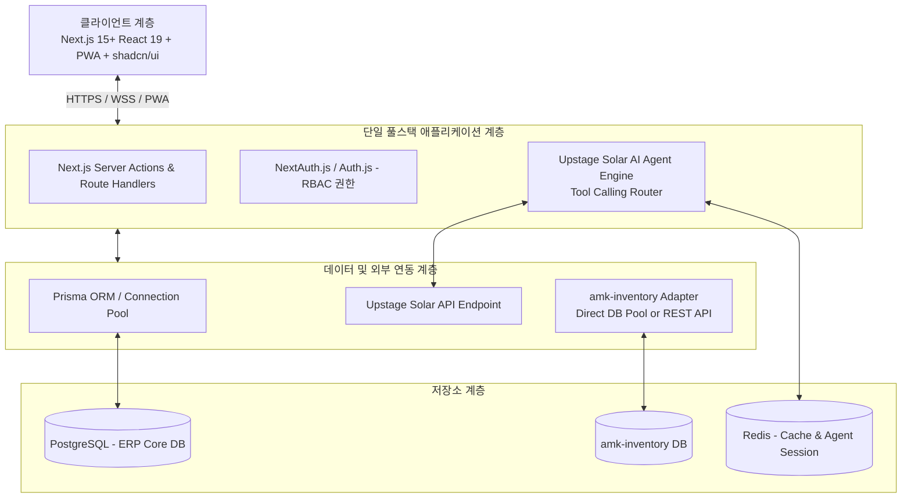

# AMK ERP 시스템 아키텍처 결정 배경 및 근거 상세 보고서 (ADR & Architecture Rationale)

**문서 번호:** AMK-ERP-ARCH-20260904  
**작성일자:** 2026-09-04  
**작성자:** AI Architecture Assistant (Pair Programming with juny79)  
**버전:** v1.0.0  
**상태:** 승인 및 기준 아키텍처 확정 (Approved)

---

## 1. 개요 및 목적

본 문서는 **AMK 맞춤형 ERP 플랫폼** 구축에 있어 선정된 핵심 기술 스택 및 시스템 구조의 **선정 이유, 기술적/비즈니스적 타당성, 트레이드오프(Trade-off) 분석**을 기록한 기술 결정 상세 보고서(Architecture Decision Record, ADR)입니다.

AMK의 업무 특성인 **'업무 일정 공유', '실시간 근태 체크', '기존 amk-inventory 재고 연동', 'Upstage Solar AI 챗봇 통합', '모바일 PWA 현장 접근성'**을 가장 효과적이고 안정적으로 달성하기 위한 구조적 근거를 제시합니다.

---

## 2. 레이어별 아키텍처 확정 및 선정 근거

---

### 2.1. 프론트엔드 및 애플리케이션 계층: Next.js (App Router, React 19) + Tailwind CSS + shadcn/ui

#### [선정 이유 및 근거]
1. **풀스택 단일 레포지토리(Single Monorepo/Codebase) 생산성**:
   - 프론트엔드와 백엔드 API를 분리할 경우, API 규격 정의, 별도 CORS 처리, 배포 파이프라인 이원화 등 오버헤드가 큽니다.
   - Next.js의 Server Actions와 Route Handlers를 활용하여 단일 코드베이스에서 타입 안전성(End-to-End TypeScript)을 유지하면서 가장 빠른 개발 속도를 낼 수 있습니다.
2. **반응형 웹 대시보드 및 모바일 PWA 최적화**:
   - 데스크톱 모니터(사무실 업무 공유)와 스마트폰/태블릿(현장 출퇴근, 재고 실사) 환경을 모두 만족해야 합니다.
   - Tailwind CSS 기반 유틸리티 스타일링과 shadcn/ui(Radix UI 기반 고품질 헤드리스 컴포넌트)를 채택하여 세련된 엔터프라이즈급 UI를 신속히 제작 가능합니다.
3. **SSR / 스트리밍 렌더링에 의한 AI 챗봇 및 대시보드 속도 향상**:
   - React 19 서버 컴포넌트(RSC) 및 스트리밍을 통해 Upstage Solar LLM의 답변 토큰을 실시간 스트리밍 형태로 대기 시간 없이 즉시 렌더링할 수 있습니다.

#### [대안 비교]
- **React SPA (Vite) + 별도 Express/NestJS 서버**: 인프라 분리로 인한 배포 복잡도 증가, SEO/공유 링크 필요 시 한계, PWA 및 초기 로딩 오버헤드 존재.
- **Django / Spring Boot**: 무겁고 초기 개발 리소스 소모 큼. 프론트엔드 최신 인터랙션(드래그앤드롭 캘린더, 실시간 챗봇 스트리밍)과의 결합 비용 높음.

---

### 2.2. AI LLM 및 Agent 코어: Upstage Solar (`solar-pro`, `solar-mini`)

#### [선정 이유 및 근거]
1. **한국어 비즈니스 도메인 및 사내 업무 이해도 우수**:
   - 사내 ERP는 한국어 일정, 부서명, 근태 용어(연차, 반차, 외근, 시업/종업), 자재 품명 등의 정확한 이해가 필수적입니다.
   - Upstage Solar는 한국어 벤치마크 최상위권 모델로, 자연어 업무 지시에서 오탈자나 구어체 문맥 파악에 탁월합니다.
2. **강력하고 정확한 Function Calling (Tool Calling)**:
   - 본 ERP의 핵심은 단순 대화가 아닌 **"실제 ERP 기능 실행(캘린더 등록, 재고 조회, 근태 기록)"**입니다.
   - Solar는 정형화된 JSON Schema 기반 Tool Calling을 정밀하게 지원하여 파라미터 누락 없이 ERP 백엔드 API를 호출할 수 있습니다.
3. **비용 효율성 및 응답 지연(Latency) 최소화**:
   - 일상적인 업무 요약/검색은 가볍고 빠른 `solar-mini`, 복잡한 데이터 분석 및 다단계 계획 수립은 `solar-pro`로 라우팅하는 하이브리드 구성이 가능하여 API 운영 비용을 대폭 절감할 수 있습니다.

---

### 2.3. 데이터베이스 및 ORM: PostgreSQL + Prisma ORM

#### [선정 이유 및 근거]
1. **엔터프라이즈 트랜잭션 무결성 (ACID)**:
   - 근태(출퇴근 시간, 급여 기초 자료), 전자결재, 재고 입출고 기록은 단 1건의 누락이나 불일치도 허용되지 않는 금융/회계 수준의 정합성이 요구됩니다.
   - PostgreSQL은 글로벌 표준 오픈소스 RDBMS로, 복합 제약조건, 외래키 무결성, Row-Level Locking을 완벽히 보장합니다.
2. **스키마 진화 및 타입 안정성 (Prisma ORM)**:
   - DB 스키마 선언(`schema.prisma`)에서 TypeScript 타입이 자동 생성되므로, 프론트-백-DB 간 타입 불일치 버그를 원천 차단합니다.
   - 마이그레이션 도구(`prisma migrate`)를 통해 지속적인 기능 확장에 유연하게 대응합니다.
3. **확장성 (JSONB 및 pgvector 지원)**:
   - 비정형 업무 첨부 메타데이터나 챗봇 대화 로그를 `JSONB` 컬럼으로 유연하게 저장 가능하며, 향후 사내 매뉴얼 RAG 검색 도입 시 `pgvector`를 통한 벡터 DB 확장이 용이합니다.

---

### 2.4. 캘린더 및 일정 공유 엔진: FullCalendar / Day.js

#### [선정 이유 및 근거]
1. **일/주/월 멀티뷰 및 반응형 완벽 지원**:
   - FullCalendar는 전 세계 엔터프라이즈 환경에서 검증된 캘린더 라이브러리로, 일간(Day), 주간(Week), 월간(Month) 뿐만 아니라 타임라인(Timeline) 뷰를 매끄럽게 지원합니다.
2. **인터랙티브 이벤트 제어 (Drag & Drop, Resize)**:
   - 마우스 드래그로 일정 이동, 리사이징으로 시간 연장이 가능하며, 변경 즉시 백엔드 DB와 연동되어 업무 처리 시간을 획기적으로 단축합니다.

---

### 2.5. 기존 재고관리(`amk-inventory`) 연동 아키텍처: Adapter Pattern

#### [선정 이유 및 근거]
1. **기존 시스템 영향 최소화 (Non-intrusive)**:
   - 기존에 가동 중인 `amk-inventory`를 전면 재개발하거나 강제로 수정하지 않고, 중간에 **전용 어댑터(Adapter Service)** 계층을 두어 연동합니다.
2. **연동 모드 호환성 (Dual-Mode Support)**:
   - `amk-inventory`가 REST API를 제공하는 경우: HTTP Client Adapter.
   - 직접 DB를 공유하는 경우: 읽기 전용(Read-Replica) Connection Pool 또는 트랜잭션 래퍼.
   - 이를 통해 기존 시스템의 안정성을 해치지 않으면서 실시간 재고 부족 알림, 입출고 일정의 캘린더 자동 등록을 구현합니다.

---

### 2.6. CI/CD 및 형상관리: GitHub + GitHub Actions

#### [선정 이유 및 근거]
1. **전 세계 표준 형상 관리 및 이슈 트래킹**:
   - `juny79/amk-erp` 저장소를 통해 코드 버전 관리, 기능 단위 Pull Request 검토, 이슈 기반 기능 개발을 체계화합니다.
2. **빌드/테스트 자동화로 배포 리스크 제거**:
   - 푸시/PR 시 GitHub Actions 러너가 타입 검사 및 린트를 강제 수행하여 결함 있는 코드가 프로덕션에 유입되는 것을 원천 차단합니다.

---

## 3. 요약 결론

위 아키텍처는 **개발 생산성, 시스템 정합성, 확장성, 모바일 사용성, 최신 AI Agent 기술 도입**이라는 다차원 요구조건을 충족하기 위해 최적화된 설계입니다.

단일 풀스택(Next.js)을 중심으로 핵심 업무 무결성(PostgreSQL)을 다지고, 한국어 최적화 LLM(Upstage Solar)을 어댑터 패턴으로 연결함으로써, 빠르고 견고하며 스마트한 AMK 전용 차세대 ERP를 실현합니다.
