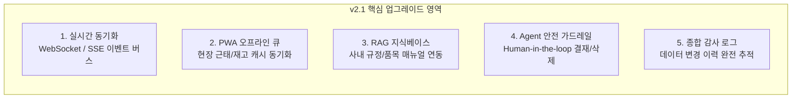
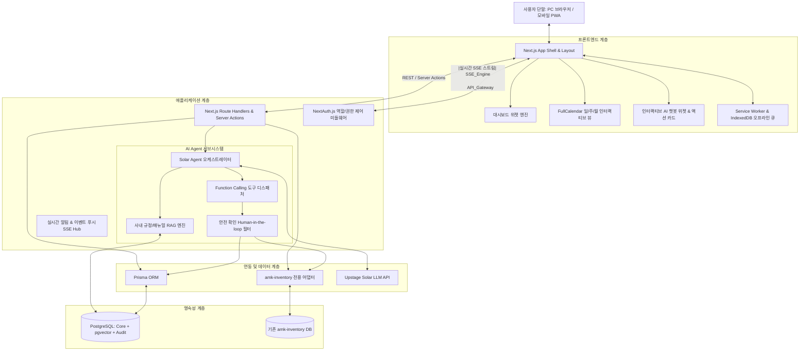

# AMK 맞춤형 ERP 시스템 종합 기획 및 아키텍처 v2.1 업그레이드 보고서

**문서 번호:** AMK-ERP-MASTERPLAN-20260904  
**작성일자:** 2026-09-04  
**작성자:** AI Solution Architect (Pair Programming with juny79)  
**버전:** v2.1.0 (Architecture Review & Upgraded Edition)  
**저장소:** [https://github.com/juny79/amk-erp](https://github.com/juny79/amk-erp)

---

## 1. 아키텍처 재검토 및 5대 핵심 보완/업그레이드 포인트

기존 기획 및 아키텍처(v2.0)를 실제 운영 환경(보안, 실시간 협업, 오프라인 환경, AI Agent 확장성) 관점에서 전면 재검토한 결과, 시스템의 완성도와 안정성을 극대화하기 위해 다음 **5가지 핵심 사항을 보완/업그레이드**하였습니다.

### 1.1. 실시간 이벤트 버스 도입 (Server-Sent Events / WebSocket)
* **기존 한계**: 사용자가 캘린더 일정을 변경하거나 타 직원이 출퇴근/휴가를 신청했을 때 화면을 새로고침해야 반영됨.
* **업그레이드**:
  * Next.js 서버와 클라이언트 간 경량 **SSE(Server-Sent Events)** 채널 구축.
  * 일정 추가, 긴급 공지, 재고 안전수량 미달 시 대시보드 및 캘린더에 실시간 라이브 업데이트 및 토스트 알림 푸시.

### 1.2. PWA 오프라인 지원 및 동기화 큐 (Background Sync)
* **기존 한계**: 현장 창고 음영지역이나 외부 네트워크 불안정 시 출퇴근 체크 및 재고 조회가 실패할 수 있음.
* **업그레이드**:
  * PWA Service Worker + IndexedDB 기반 로컬 캐싱.
  * 네트워크 단절 상태에서도 출퇴근 버튼 클릭 시 로컬 큐에 타임스탬프와 함께 보관된 후, 인터넷 재연결 시 백엔드로 자동 동기화.

### 1.3. Upstage Solar AI Agent의 RAG(검색 증강 생성) 지식베이스 확장
* **기존 한계**: 단순 Function Calling(기능 실행)만 지원하여 "사내 취업규칙/연차 규정이 어떻게 되지?", "이 자재의 규격 매뉴얼이 어떻게 되지?" 같은 사내 지식 기반 질의 대응 불가.
* **업그레이드**:
  * PostgreSQL `pgvector` 또는 Upstage Document Parse / Vector Search를 연계.
  * 사내 내규, 부품 사양서, 작업 표준서를 RAG로 인덱싱하여 Agent가 사내 규정 질문에도 즉답 가능하도록 진화.

### 1.4. AI Agent 실행 가드레일 (Human-in-the-Loop & Safe Confirm)
* **기존 한계**: 자연어 명령으로 데이터가 무단 삭제되거나(예: "일정 다 지워줘"), 잘못된 수량으로 재고 발주가 실행될 위험.
* **업그레이드**:
  * 조회(Read) 작업은 챗봇이 즉시 수행하되, **변경(Create/Update/Delete)** 작업은 챗봇 응답창에 `[승인 / 취소]` 확인 카드를 띄워 사용자가 최종 클릭해야 DB에 반영되는 안전 가드레일(Human-in-the-Loop) 적용.

### 1.5. 엔터프라이즈 감사 로그 (Audit Trail) 체계
* **기존 한계**: 근태 기록 수정이나 재고 데이터 변경 시 누가, 언제, 왜 바꿨는지 추적 어려움.
* **업그레이드**:
  * 근태 및 재고 변경 건에 대해 `AuditLog` 테이블을 필수 트리거링하여 사후 감사 및 정합성 보장.

---

## 2. v2.1 업그레이드 시스템 아키텍처 다이어그램

---

## 3. 핵심 모듈별 상세 기능 명세 (v2.1)

### 3.1. 스마트 업무 공유 & 캘린더 플랫폼
* **다차원 캘린더 뷰**:
  * **일간 (Day)**: 시간대별 일정 타임테이블, 긴급 마감 To-Do, AI 일일 브리핑.
  * **주간 (Week)**: 팀원별 업무 부하량, 프로젝트 단계별 진척선, 주간 마일스톤.
  * **월간 (Month)**: 전사 주요 납기일, 자재 입고/완제품 출하 예정일(재고 연동).
* **칸반 보드(Kanban) 일원화**:
  * 캘린더의 일정이 곧 칸반 카드로 연동되어 상태(대기 $\rightarrow$ 진행 $\rightarrow$ 검토 $\rightarrow$ 완료) 드래그 이동 시 캘린더 상태도 실시간 동기화.
* **실시간 협업**: 담당자 멘션(@), 실시간 코멘트, 파일 첨부, SSE 기반 변경 알림.

### 3.2. 스마트 근태 관리 시스템
* **스마트 출퇴근 체크**:
  * 사내 Wi-Fi IP 대역 인증 및 모바일 위치(GPS) 반경 검증(부정 출퇴근 방지).
  * 현장 오프라인 지원: 통신 두절 시 로컬 암호화 저장 후 복구 시 자동 제출.
* **실시간 근태 현황판**: 당일 출근, 지각, 휴가, 출장/외근자 실시간 색상 표시.
* **간이 전자결재**: 연차/반차, 대체휴무, 외근/출장 신청 및 팀장 1차 승인 결재선.
* **통계 및 노무 관리**: 주 52시간 초과 경고 알림, 월별 출근부 엑셀(CSV) 원클릭 출력.

### 3.3. `amk-inventory` 재고관리 연동 파이프라인
* **실시간 재고 모니터링**: 핵심 원자재/부품의 현재고, 안전재고 미달 품목 실시간 대시보드 경고.
* **일정 자동 연계**:
  * `amk-inventory`의 입고 예정일, 출하 예정일이 ERP 업무 캘린더에 전사 공유 일정으로 자동 표시.
* **Agent 연동 지원**: 자연어로 재고 수량/보관 위치/입출고 이력 즉시 조회 및 부족 자재 발주 결재 작성 보조.

### 3.4. Upstage Solar AI Agent 챗봇 (v2.1 업그레이드)
* **역할**: 전사 ERP 비서 (사내 일정, 근태, 재고, 규정 총괄)
* **주요 Function Calling 도구 목록**:
  1. `get_my_schedule(date_range)`: 기간별 본인 및 팀 일정 조회
  2. `create_schedule(title, start, end, attendees, project)`: 일정 캘린더 등록 (확인 카드 제공)
  3. `check_attendance(status, note)`: 출근/퇴근/외근 체크
  4. `apply_leave(leave_type, start_date, end_date, reason)`: 휴가/연차 신청서 상신
  5. `query_inventory_stock(item_code_or_name)`: 부품 재고 수량 및 창고 위치 실시간 조회
  6. `get_low_stock_alerts()`: 안전재고 미달 품목 리스트 및 발주 필요 품목 조회
  7. `search_company_policy(query)`: 사내 규정, 복리후생, 부품 매뉴얼 RAG 시맨틱 검색
* **안전 가드레일**: 생성/수정/삭제 명령 시 대화창에 `[실행 확인]` 버튼을 띄우고 사용자 확인 후 반영.

---

## 4. 데이터베이스 엔터티 모델링 요약 (Prisma Schema 기준)

1. **User / Department / Role**: 사번, 이름, 이메일, 직급, 부서, 권한(ADMIN, MANAGER, STAFF)
2. **Attendance**: 일자, 사용자ID, 출근시각, 퇴근시각, 근무상태(정상, 지각, 조퇴, 결근, 외근), IP/GPS 기록
3. **LeaveRequest (결재)**: 사용자ID, 결재자ID, 휴가종류(연차, 반차, 경조사), 기간, 사유, 승인상태(PENDING, APPROVED, REJECTED)
4. **Task (업무/캘린더)**: 제목, 설명, 시작일시, 종료일시, 상태(TODO, IN_PROGRESS, REVIEW, DONE), 담당자ID, 부서ID, 태그, 중요도
5. **InventoryLinkCache**: 품목코드, 품명, 현재고, 안전재고, 보관위치, 최종동기화일시 (amk-inventory 연동 캐시)
6. **ChatMessage / Session**: 사용자ID, 대화세션ID, 롤(user/assistant), 내용, 함수호출데이터, 타임스탬프
7. **AuditLog**: 변경주체, 액션(CREATE/UPDATE/DELETE), 대상엔터티, 변경 전/후 JSON, IP, 타임스탬프

---

## 5. 단계별 실행 계획 (Updated Roadmap)

| 단계 | 목표 | 주요 상세 산출물 |
| :--- | :--- | :--- |
| **Phase 1 (완료)** | 기반 구축 & 형상관리 | • Git 초기화, GitHub 원격 연동, Actions CI/CD 구축 완료 |
| **Phase 2 (현재)** | 프로젝트 골격 & DB 모델링 | • Next.js 15 + Tailwind + shadcn/ui 기반 대시보드 쉘 구축 • PostgreSQL Prisma 스키마(v2.1 엔터티) 및 DB 마이그레이션 |
| **Phase 3** | 업무 캘린더 & 칸반 모듈 | • FullCalendar 일/주/월 인터랙티브 뷰 + 칸반 드래그앤드롭 • 업무 등록/수정 모달 및 부서/담당자 필터링 |
| **Phase 4** | 근태 관리 & 간이 전자결재 | • 원클릭 출퇴근 체크(사내망/위치 검증) + 근태 현황판 • 연차/외근 신청 및 팀장 승인 결재 플로우, 엑셀 출력 |
| **Phase 5** | `amk-inventory` 어댑터 연동 | • 재고 데이터 파이프라인 연동 어댑터 구축 • 대시보드 안전재고 위젯 & 입출고 일정 캘린더 동기화 |
| **Phase 6** | Upstage Solar AI Agent | • Vercel AI SDK + Solar API 연동 및 7종 Tool Calling 구현 • 인터랙티브 확인 카드 UI & 사내 매뉴얼 RAG 모듈 |
| **Phase 7** | 실시간 이벤트 & PWA 배포 | • SSE 실시간 알림 Hub + PWA 오프라인 큐 완성 • 최종 프로덕션 통합 테스트 및 클라우드/온프레미스 배포 |

---

## 6. 결론

본 v2.1 업그레이드 종합 기획은 단순한 관리 프로그램 수준을 넘어, **현장 대응력(PWA 오프라인)**, **팀 협업 속도(실시간 SSE)**, **업무 안전성(가드레일 & 감사 로그)**, **지능형 자동화(Upstage Solar Agent + RAG)**를 모두 갖춘 차세대 완성형 ERP 모델입니다.
