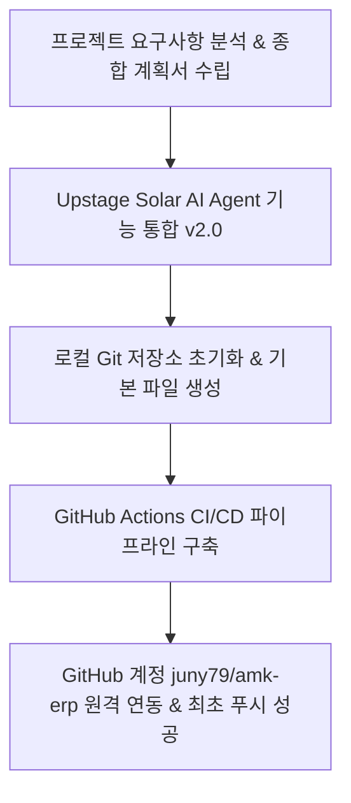
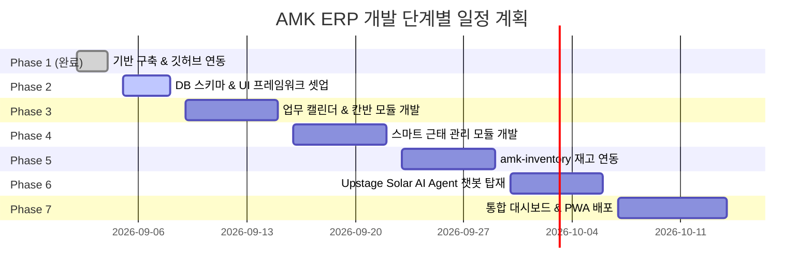

# AMK 맞춤형 ERP 시스템 개발 현황 보고서

**문서 번호:** AMK-ERP-STATUS-20260904  
**작성일자:** 2026-09-04  
**작성자:** AI Development Assistant (Pair Programming with juny79)  
**저장소:** [https://github.com/juny79/amk-erp](https://github.com/juny79/amk-erp)  
**버전:** v1.0.0 (Phase 1 Init Completed)

---

## 1. 프로젝트 개요 및 배경

본 프로젝트는 **AMK**의 비즈니스 환경과 업무 프로세스에 최적화된 올인원 통합 ERP 웹 애플리케이션 개발을 목표로 합니다.
기존 분산되어 있던 **업무 공유 체계(일/주/월 캘린더)**, **근태 관리(출퇴근 체크)**, **기존 재고관리 프로그램(`amk-inventory`)**을 일원화하고, **Upstage Solar LLM 기반 지능형 AI Agent 챗봇**을 연동하여 자연어 대화형 업무/재고 관리를 구현합니다.

---

## 2. 지금까지의 진행 현황 (Phase 1 기반 구축 완료)

### 2.1. 종합 기획 및 아키텍처 설계
- **요구사항 정의**:
  - 일간 / 주간 / 월간 멀티뷰 캘린더 기반 업무 공유 및 칸반(Kanban) 보드 연동
  - 사내 IP/GPS 기반 원클릭 출퇴근 체크 및 간이 전자결재(휴가/외근)
  - 기존 `amk-inventory` 재고관리 프로그램 연동 (실시간 재고 조회, 안전재고 부족 알림)
  - **Upstage Solar AI Agent 챗봇 탑재**: Function Calling을 통한 자연어 일정 등록/조회, 재고 확인, 근태 체크
- **아키텍처 확정**:
  - **Frontend**: Next.js (React 19, App Router) + Tailwind CSS + shadcn/ui
  - **AI / LLM Core**: Upstage Solar API (`solar-pro` / `solar-mini`) + Vercel AI SDK
  - **Calendar UI**: FullCalendar / TanStack Virtual
  - **Backend & DB**: Next.js Route Handlers + PostgreSQL / Prisma ORM
  - **배포 & 웹앱**: PWA (Progressive Web App) + GitHub Actions CI/CD

### 2.2. 형상 관리 및 CI/CD 파이프라인 구축
- **Git 리포지토리 구성**:
  - 브랜치: `main` (기본 운영 브랜치)
  - 커밋 작성자 및 원격 저장소: `juny79 (quriquri7@gmail.com)` / `https://github.com/juny79/amk-erp`
- **GitHub Actions CI/CD 설정 (`.github/workflows/ci-cd.yml`)**:
  - Push 및 PR 시 자동 Node.js 20 런타임 환경 구성
  - 코드 린트 검사(`npm run lint`) 및 프로덕션 빌드(`npm run build`) 무결성 테스트
  - Upstage API Key 및 DB Secret 보안 주입 구조 완비

---

## 3. 프로젝트 산출물 현황

| 구분 | 파일 경로 | 설명 | 상태 |
| :--- | :--- | :--- | :---: |
| **기획 문서** | `docs/DEVELOPMENT_STATUS_REPORT.md` | 현재 개발 현황 종합 보고서 | ✅ 완료 |
| **설명 문서** | `README.md` | 프로젝트 소개 및 주요 기능 명세 | ✅ 완료 |
| **형상 설정** | `.gitignore` | 민감 정보 및 빌드 산출물 제외 규칙 | ✅ 완료 |
| **CI/CD** | `.github/workflows/ci-cd.yml` | 자동 빌드/테스트 파이프라인 | ✅ 완료 |
| **원격 저장소** | `https://github.com/juny79/amk-erp` | GitHub 원격 메인 브랜치 동기화 | ✅ 푸시 완료 |

---

## 4. 향후 개발 로드맵 (Next Steps)

1. **Phase 2 (차기 진행 작업)**:
   - Next.js 템플릿 및 shadcn/ui 기반 대시보드 레이아웃 셋업
   - PostgreSQL / Prisma 스키마 모델링 (`User`, `Attendance`, `Task`, `InventoryLink`, `ChatMessage`)
2. **Phase 3 (업무 & 캘린더)**:
   - FullCalendar 기반 일간/주간/월간 뷰 및 업무 카드 CRUD, 팀원 공유
3. **Phase 4 (근태 관리)**:
   - 원클릭 출퇴근 체크, 실시간 근태 현황판, 연차/휴가 결재선 구축
4. **Phase 5 (재고 연동)**:
   - `amk-inventory` 데이터 파이프라인 연계 및 안전재고 알림, 입출고 일정 캘린더 동기화
5. **Phase 6 (Upstage Solar AI Agent)**:
   - Function Calling 기반 자연어 대화형 일정 등록, 재고 조회, 근태 처리 챗봇 UI 탑재
6. **Phase 7 (대시보드 & PWA 웹앱)**:
   - 모바일 홈 화면 추가(PWA), 전사 배포 및 안정화
