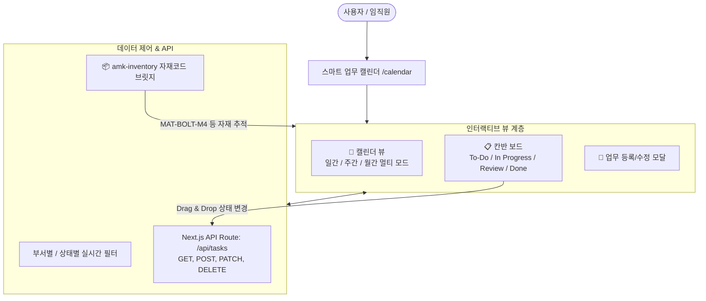

# AMK ERP Phase 3 진행과정 및 결과 상세 보고서

**문서 번호:** AMK-ERP-PHASE3-20260907  
**작성일자:** 2026-09-07  
**작성자:** AI Development Assistant (Pair Programming with juny79)  
**버전:** v3.0.0 (Phase 3 Completed)  
**저장소:** [https://github.com/juny79/amk-erp](https://github.com/juny79/amk-erp)

---

## 1. 개요 및 목표

Phase 3 단계의 목표는 **AMK의 전사 업무 공유 및 일정 관리 체계**를 혁신하기 위한 **일간/주간/월간 멀티뷰 캘린더**와 **드래그 앤 드롭 칸반 보드(Kanban Board)**를 개발하고, 기존 **`amk-inventory` 자재코드와의 연동 기반**을 구축하는 것입니다.

---

## 2. 세부 개발 내역 및 핵심 기능



### 2.1. 업무 모델 정의 및 RESTful API 엔드포인트 구축
- **데이터 모델 (`src/types/task.ts`)**:
  - `id`, `title`, `description`, `startDate`, `endDate`, `allDay`
  - `status`: `TODO`, `IN_PROGRESS`, `REVIEW`, `DONE`
  - `priority`: `LOW`, `MEDIUM`, `HIGH`, `URGENT`
  - `assigneeName`, `department` (생산팀, 자재팀, 영업팀, 품질팀, 인사총무)
  - `linkedItemCode`: `amk-inventory` 자재코드 매핑
- **API 엔드포인트 (`src/app/api/tasks/route.ts`)**:
  - `GET /api/tasks`: 부서별/상태별 필터링 조회
  - `POST /api/tasks`: 신규 업무/일정 등록
  - `PATCH /api/tasks`: 일정 정보 수정 및 칸반 상태 실시간 변경
  - `DELETE /api/tasks`: 업무 삭제

### 2.2. 일간 / 주간 / 월간 멀티뷰 캘린더 (`src/components/calendar/CalendarView.tsx`)
- **월간 뷰 (Month)**:
  - 당월 전체 일정 및 당일(`Today`) 하이라이트 표시
  - 일정별 컬러 바 및 자재 연동 뱃지(`amk-inventory`) 시각화
- **주간 뷰 (Week)**:
  - 요일별 타임라인 및 시간대(`09:00 ~ 12:00`) 표출, 담당자 및 부서 태그 확인
- **일간 뷰 (Day)**:
  - 당일 집중 업무 및 긴급 마감 일정 브리핑 카드 형태 제공

### 2.3. HTML5 드래그 앤 드롭 칸반 보드 (`src/components/kanban/KanbanBoard.tsx`)
- 4단계 컬럼 구조: **대기(To-Do) $\rightarrow$ 진행중(In Progress) $\rightarrow$ 검토(Review) $\rightarrow$ 완료(Done)**
- 마우스 드래그 앤 드롭으로 카드 상태를 변경하면, 낙관적 UI 업데이트(Optimistic Update)와 함께 백엔드 API에 즉시 동기화.
- 카드 내 중요도 뱃지, 담당자, 마감일, 연동 자재코드 실시간 표출.

### 2.4. 업무/일정 등록 및 수정 모달 (`src/components/calendar/TaskModal.tsx`)
- 일정명, 시작/종료 일시, 중요도, 부서, 담당자명, 태그 등록
- `amk-inventory` 자재코드(`linkedItemCode`) 입력란을 제공하여 특정 자재 조립/발주 일정과 직결.

---

## 3. Phase 3 산출물 목록

| 파일 경로 | 설명 | 상태 |
| :--- | :--- | :---: |
| `src/types/task.ts` | 업무 및 일정 TypeScript 인터페이스 정의 | ✅ 완료 |
| `src/lib/mockTasks.ts` | 초기 AMK 업무 및 재고연계 샘플 데이터 | ✅ 완료 |
| `src/app/api/tasks/route.ts` | Next.js API Route (CRUD & 필터링) | ✅ 완료 |
| `src/components/calendar/TaskModal.tsx` | 일정 등록/수정 팝업 모달 | ✅ 완료 |
| `src/components/calendar/CalendarView.tsx` | 일/주/월간 멀티뷰 캘린더 컴포넌트 | ✅ 완료 |
| `src/components/kanban/KanbanBoard.tsx` | HTML5 드래그앤드롭 칸반 보드 컴포넌트 | ✅ 완료 |
| `src/app/calendar/page.tsx` | 업무 캘린더 & 칸반 통합 페이지 (`/calendar`) | ✅ 완료 |
| `src/app/page.tsx` | 메인 대시보드 내 캘린더 모듈 연결 및 배너 업데이트 | ✅ 완료 |

---

## 4. 로컬 구동 및 테스트 방법

1. 브라우저에서 개발 서버 실행:
   ```powershell
   cd C:\Users\quriq\.gemini\antigravity\scratch\amk-erp
   npm run dev
   ```
2. 웹 브라우저 접속:
   - 메인 대시보드: `http://localhost:3000`
   - 스마트 캘린더 / 칸반 페이지: `http://localhost:3000/calendar`

---

## 5. 다음 단계 로드맵 (Phase 4 안내)

- **목표**: **스마트 근태 관리 시스템 구축**
- **주요 작업**:
  1. 사내 Wi-Fi IP 및 모바일 위치(GPS) 기반 **원클릭 출퇴근 체크** UI 및 API 구현
  2. 당일 출근/지각/조퇴/외근/휴가자 실시간 **근무 현황판 위젯** 개발
  3. 연차/반차/외근 신청 및 팀장 승인 **간이 전자결재 워크플로우** 구현
