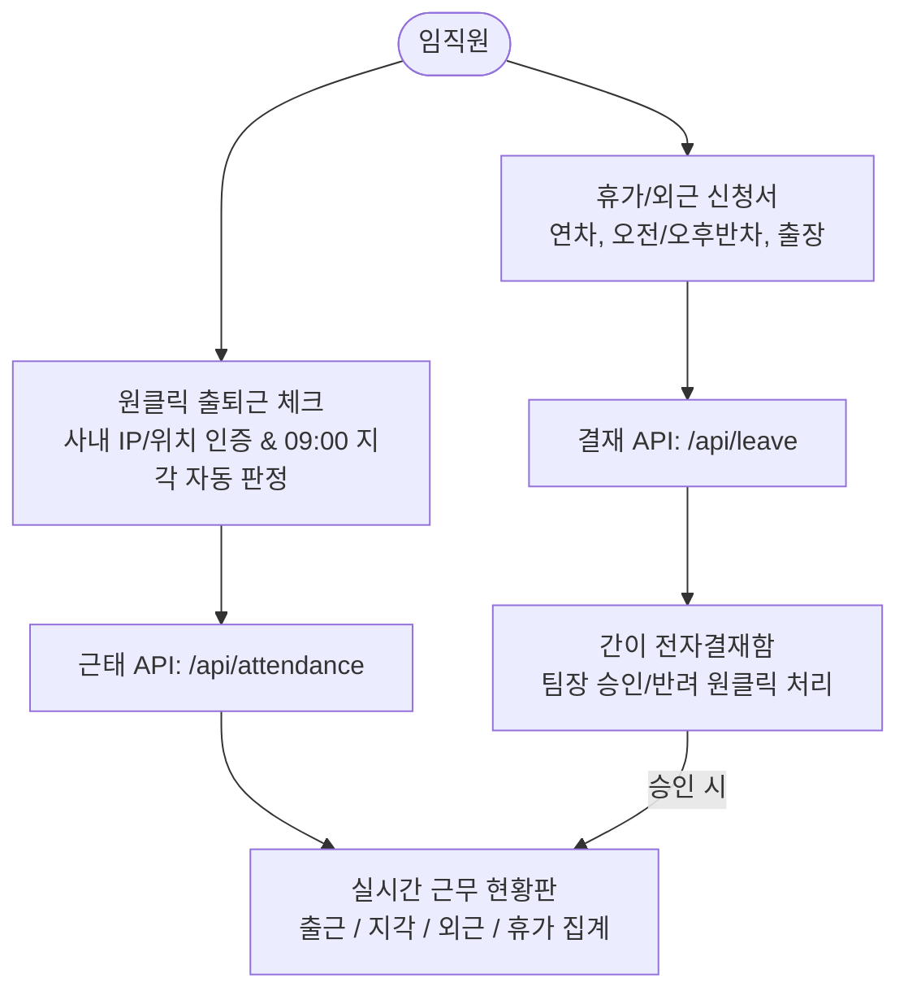

# AMK ERP Phase 4 진행과정 및 결과 상세 보고서

**문서 번호:** AMK-ERP-PHASE4-20260907  
**작성일자:** 2026-09-07  
**작성자:** AI Development Assistant (Pair Programming with juny79)  
**버전:** v4.0.0 (Phase 4 Completed)  
**저장소:** [https://github.com/juny79/amk-erp](https://github.com/juny79/amk-erp)

---

## 1. 개요 및 목표

Phase 4 단계의 목표는 **AMK 사내 근무 환경 및 노무 관리의 효율화**를 달성하기 위해 **원클릭 출퇴근 체크(사내 네트워크 인증/지각 자동판정)**, **실시간 전사 근무 현황판**, **연차/외근/반차 간이 전자결재 승인 워크플로우**를 완벽하게 구축하는 것입니다.

---

## 2. 세부 개발 내역 및 핵심 기능

### 2.1. 원클릭 스마트 출퇴근 체크 (`src/components/attendance/AttendanceCheckCard.tsx`)
- **실시간 디지털 시계 및 사내망 인증**:
  - AMK 사내 Wi-Fi/유선망 IP(`192.168.0.21`) 및 위치 상태를 자동 감지하여 표출.
- **출근 / 퇴근 원클릭 처리**:
  - `09:00:00` 기준 자동 지각(Late) / 정상(Normal) 상태 자동 판정.
  - 퇴근 체크 시 당일 총 근무 시간(소수점 1자리 시간 단위) 자동 산출.
  - 중복 체크 방지 및 버튼 상태 인터랙션(출근 완료 시 퇴근 버튼 활성화).

### 2.2. 당일 전사 근태 KPI 통계 및 실시간 근무 현황판 (`src/components/attendance/AttendanceStatusBoard.tsx`)
- **KPI 통계 위젯**:
  - 당일 출근율(`%`), 지각자 수, 외근/출장자 수, 연차/휴가자 수 실시간 집계.
- **전사 현황 테이블**:
  - 임직원별 성명, 부서, 직급, 출근시각, 퇴근시각, 근무상태 뱃지, 근무지 및 특이사항 조회.

### 2.3. 간이 전자결재 워크플로우 (`src/components/attendance/LeaveApplyModal.tsx` & `/api/leave`)
- **신청 양식 지원**:
  - 정기 연차(1일), 오전 반차(0.5일), 오후 반차(0.5일), 외근/출장, 경조사 휴가, 연장근무.
- **결재함 승인/반려 관리**:
  - 팀장/관리자가 결재 대기 중인 신청 건을 확인하고 `[승인]` 또는 `[반려]` 원클릭 처리.
  - 승인 즉시 상태가 확정되고 근무 현황판에 연동.

---

## 3. Phase 4 산출물 목록

| 파일 경로 | 설명 | 상태 |
| :--- | :--- | :---: |
| `src/types/attendance.ts` | 근태 기록 및 결재 신청 TypeScript 인터페이스 | ✅ 완료 |
| `src/lib/mockAttendance.ts` | 근태 기록 및 결재 초기 데이터 | ✅ 완료 |
| `src/app/api/attendance/route.ts` | 출퇴근 체크 및 근무 현황 조회 API | ✅ 완료 |
| `src/app/api/leave/route.ts` | 휴가/외근 신청 및 승인/반려 처리 API | ✅ 완료 |
| `src/components/attendance/AttendanceCheckCard.tsx` | 개인 원클릭 출퇴근 체크 컴포넌트 | ✅ 완료 |
| `src/components/attendance/AttendanceStatusBoard.tsx` | 전사 실시간 근무 현황판 컴포넌트 | ✅ 완료 |
| `src/components/attendance/LeaveApplyModal.tsx` | 휴가/외근 신청 팝업 모달 | ✅ 완료 |
| `src/app/attendance/page.tsx` | 근태 관리 통합 메인 페이지 (`/attendance`) | ✅ 완료 |
| `src/app/page.tsx` | 대시보드 내 근태 관리 바로가기 연동 및 배너 갱신 | ✅ 완료 |

---

## 4. 접속 및 테스트 방법

- **개발 서버**: 로컬 3000번 포트에서 백그라운드 구동 중
- **브라우저 접속 URL**:
  - 스마트 근태 관리 페이지: `http://localhost:3000/attendance`
  - 스마트 업무 캘린더 페이지: `http://localhost:3000/calendar`
  - 메인 대시보드: `http://localhost:3000`

---

## 5. 다음 단계 로드맵 (Phase 5 안내)

- **목표**: **`amk-inventory` 기존 재고관리 프로그램 데이터 파이프라인 연동**
- **주요 작업**:
  1. `amk-inventory` 전용 어댑터(Adapter) 모듈 개발 (품목, 현재고, 안전재고 조회)
  2. 안전재고 미달 품목 실시간 경고 알림 위젯 탑재
  3. 재고 입출고 일정의 업무 캘린더(`Phase 3`) 자동 동기화