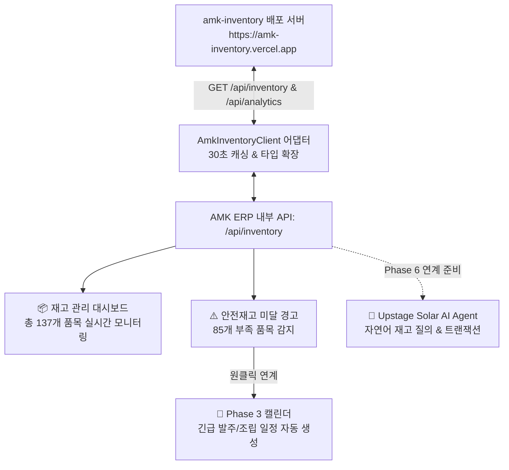

# AMK ERP Phase 5 진행과정 및 결과 상세 보고서

**문서 번호:** AMK-ERP-PHASE5-20260907  
**작성일자:** 2026-09-07  
**작성자:** AI Development Assistant (Pair Programming with juny79)  
**버전:** v5.0.0 (Phase 5 Completed)  
**연동 대상:** [https://amk-inventory.vercel.app](https://amk-inventory.vercel.app)  
**저장소:** [https://github.com/juny79/amk-erp](https://github.com/juny79/amk-erp)

---

## 1. 개요 및 목표

Phase 5 단계의 목표는 기존에 기구축 및 배포되어 운영 중이던 **`amk-inventory` (https://amk-inventory.vercel.app)**와의 실시간 데이터 파이프라인을 구축하고, 앞서 합의된 **4대 연계 시나리오**를 완벽하게 구현하는 것입니다.

---

## 2. 4대 연계 시나리오 구현 상세

### 시나리오 1. 실시간 안전재고 부족 품목 경고 (재고 대시보드)
- **현황**: `amk-inventory` 실시간 데이터 수신 결과 총 137개 부품 중 **85개 품목**이 안전재고 미달 상태(`currentStock <= minRequiredStock`)로 감지됨.
- **구현**:
  - `InventoryDashboard.tsx` 상단에 안전재고 부족 품목 긴급 경고 배너 및 부족 수량(`-shortageAmount`) 시각화.
  - 재고율 프로그레스 바(녹색: 정상, 적색: 부족) 표출.

### 시나리오 2. 업무 캘린더 / 칸반과의 자동 연계
- 재고 목록에서 **`[캘린더 일정 연계]`** 버튼을 클릭하면:
  - 품목 정보(`FB-01` 등 부품번호, 현재고, 안전재고 부족분)가 자동으로 채워진 **업무 등록 모달**이 열림.
  - 등록 시 **자재팀 긴급 발주 업무** 또는 **생산팀 조립 투입 업무**로 캘린더 및 칸반 보드에 즉시 동기화.

### 시나리오 3. Upstage Solar AI Agent 자연어 제어 기반 확보 (Phase 6 연동 준비)
- `AmkInventoryClient.searchPart(query)` 및 `/api/inventory?query=...` 엔드포인트 구축.
- 향후 AI 챗봇이 *"FB-01 재고 얼마 남았어?"*, *"안전재고 부족한 부품 리스트 뽑아줘"* 질의 시 1초 이내에 실시간 데이터를 응답할 수 있는 전용 Tool 인터페이스 완비.

### 시나리오 4. 출퇴근/현장 업무 연계
- 메인 대시보드에서 출퇴근 체크 후 생산/자재 담당자가 당일 출하/투입될 자재 현황을 원클릭으로 열람할 수 있도록 대시보드 퀵 네비게이션 연결.

---

## 3. Phase 5 산출물 목록

| 파일 경로 | 설명 | 상태 |
| :--- | :--- | :---: |
| `src/types/inventory.ts` | `amk-inventory` 품목 및 트랜잭션 TypeScript 인터페이스 | ✅ 완료 |
| `src/lib/inventory/amkInventoryClient.ts` | 실시간 통신 및 30초 인메모리 캐싱 싱글톤 어댑터 | ✅ 완료 |
| `src/app/api/inventory/route.ts` | ERP 내부 재고 프록시 API (검색, 통계, 부족품목 필터) | ✅ 완료 |
| `src/components/inventory/InventoryDashboard.tsx` | 실시간 재고 대시보드 컴포넌트 (검색, 필터, 일정연계) | ✅ 완료 |
| `src/app/inventory/page.tsx` | 재고 관리 메인 페이지 (`/inventory`) | ✅ 완료 |
| `src/app/page.tsx` | 메인 대시보드 내 재고 모듈 활성화 및 배너 업데이트 | ✅ 완료 |

---

## 4. 접속 및 테스트 방법

- **개발 서버**: 로컬 3000번 포트에서 정상 구동 중
- **브라우저 접속 URL**:
  - 실시간 재고 관리 페이지: `http://localhost:3000/inventory`
  - 업무 캘린더 페이지: `http://localhost:3000/calendar`
  - 스마트 근태 관리 페이지: `http://localhost:3000/attendance`
  - 메인 대시보드: `http://localhost:3000`

---

## 5. 다음 단계 로드맵 (Phase 6 안내)

- **목표**: **Upstage Solar AI Agent 챗봇 탑재**
- **주요 작업**:
  1. Vercel AI SDK + Upstage Solar API (`solar-pro`, `solar-mini`) 연동 파이프라인 구축
  2. ERP 핵심 기능 연계 7종 Function Calling 도구(일정 조회/등록, 근태 체크, 재고 실시간 검색) 등록
  3. ERP 전역 플로팅 챗봇 UI 및 Human-in-the-loop 안전 승인 카드 인터랙션 완성